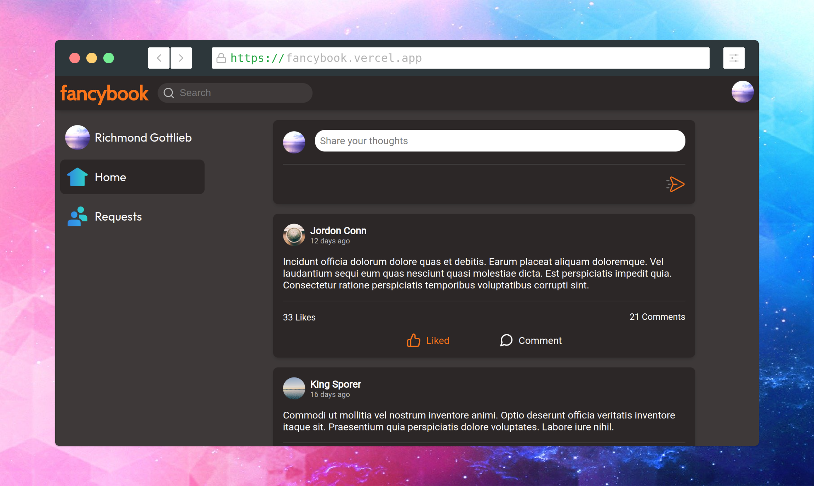

  

  A social network app built with React, NodeJS and MongoDB.

  

## Setup

1. Clone this repository.
2. Open a terminal and navigate into the root directory of your local repository.
3. Install dependencies:  
        npm install
4. Create a MongoDB database. See [Get started with MongoDB Atlas](https://www.freecodecamp.org/news/get-started-with-mongodb-atlas/).
5. Create a .env file in the backend directory and add a MONGODB_URL variable with your MongoDB connection string:  
        echo "MONGODB_URL=<Your mongodb connection string>" > backend/.env
   **Note: at this point the app is ready to be launched. If you do not need any of the features below, skip to step 8.**
6. Set up Google OAuth:
   - Register your app in the Google Cloud platform. Check [Setting up OAuth 2.0](https://support.google.com/cloud/answer/6158849?hl=en).
   - Add **GOOGLE_CLIENT_ID** and **GOOGLE_CLIENT_SECRET** environment variables to the backend .env file:
          GOOGLE_CLIENT_ID=<Your google client ID>
          GOOGLE_CLIENT_SECRET=<Your google client secret>
7. Enable user image upload:
   - [Create a free cloudinary account.](https://cloudinary.com/users/register_free)
   - Navigate to the cloudinary dashboard.
   - Copy the cloudinary environment variable into the backend .env file:
          CLOUDINARY_URL=<Your cloudinary URL>
8. Start the app:
        npm start
   The client will be available at **localhost:3000**.

## Tests

This app features unit and integration tests with **jest** and **testing-library**.

The test runner can be launched in the root directory by running:

     npm test
